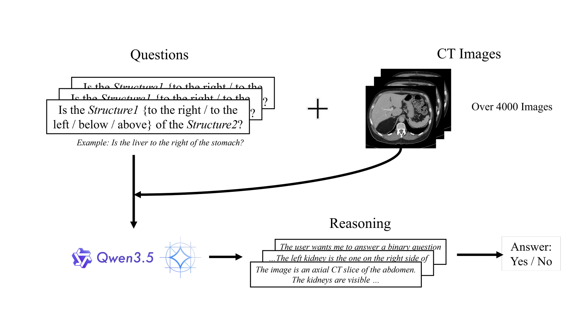

# Evaluating Reasoning Models on the MIRP Benchmark

This repository contains the scripts and outputs used to evaluate reasoning vision-language models on the MIRP benchmark.



## Project Structure

- [control/](control/) contains the inference scripts and experiment launchers.
- [control/results/](control/results/) contains evaluation code and saved outputs.
- [models/](models/) is the local vlm location.

## Requirements

The project was run on bwUniCluster 3.0 inside a Docker container. 

```eval
vllm+vllm-openai+v0.19.0.sqsh
```
The scripts assume access to the MIRP benchmark dataset in the layout expected by the control scripts and a local model checkout under [models/](models/).

All python dependencies are include in the bash file

To clone the repository:

```bash
git clone https://github.com/Omar-Gamaleldin/VLMs-Medical-Imaging
cd VLMs-Medical-Imaging
```

## Inference

The `control/` folder contains the main inference entry points. Each script reads the dataset from `--data_dir` and writes run outputs into a results directory.

SLURM is used to manage jobs on the Cluster thus sbatch is used to run the scripts:
### Qwen 3.5

Thinking mode:

```bash
sbatch -t 32:00:00 -p gpu_h100 control/qwen_3.5_thinking.sh
```

Instruction mode:

```bash
sbatch -t 06:00:00 -p gpu_h100 control/qwen_3.5.sh
```


### Gemma 4

Thinking mode:

```bash
sbatch -t 32:00:00 -p gpu_h100 control/gemma_4_thinking.sh
```

Instruction mode:

```bash
sbatch -t 06:00:00 -p gpu_h100 control/gemma_4.sh
```


### MedGemma

```bash
sbatch -t 06:00:00 -p gpu_h100 control/medgemma.sh
```

## Evaluation

The result scripts in [control/results/](control/results/) aggregate the JSON outputs produced by inference.

Image-ground-truth scoring:

```bash
python3 control/results/RQ1_RQ2_RQ3-2_calculate_results_image.py
```

Anatomy-based scoring for left/right questions:

```bash
python3 control/results/RQ1_calculate_results_anatomy.py
```

Both scripts read answer JSON files from the local results tree and write Excel summaries next to the input folders.

## Results

The repository stores run outputs in the result folders under [control/results/](control/results/). Representative output locations include:

| Model (Thinking Tokens) | RQ1 | RQ2 | RQ3  | AS   |
|-------------------------|-----|-----|------|------|
| Gemma 4  (0)            | 51% | 60% | 90%  | 94%  |
| Gemma 4 (2048)          | 49% | 94% | 100% | 100% |
| Gemma 4 (4096)          | 51% | 94% | 100% | 100% |
| Qwen 3.5 (0)            | 52% | 65% | 92%  | 96%  |
| Qwen 3.5 (2048)         | 51% | 91% | 100% | 100% |
| Qwen 3.5 (4096)         | 51% | 95% | 100% | 100% |
| MedGemma 1.5 (0)        | 51% | 51% | 54%  | 60%  |


The results of the models in detail are shown in this file`Control_Results.xlsx` within [control/results/](control/results/) 

